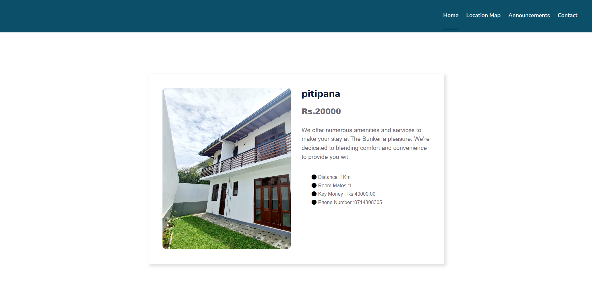

<h2 align="left">NSBM-accommodations-web-application</h2> 

<h4 align="left">LANGUAGES AND TOOLS </h4>

 

 

This is a web application built using HTML, CSS, PHP, JavaScript, and MySQL for the PUSL2020 - Software Development Tools and Practices module coursework. 
The platform was developed to help NSBM Green University students find suitable accommodations such as on-campus residences, off-campus housing, homestays, and shared apartments. 
It connects students, landlords, and wardens through a centralized, secure, and easy-to-use system.

<h4 align="left">Key Features </h4>

<h5 align="left">Student Features </h5>
<ul align="left">
  <li>Register/Login to the platform.</li>
  <li>Search accommodations by location, price, and amenities.</li>
  <li>View detailed property information with images and maps.</li>
  <li>Reserve accommodations online.</li>
  <li>View and manage booking history.</li>
</ul>

<h5 align="left">Landlord Features </h5>
<ul align="left">
  <li>Register/Login and manage property listings.</li>
  <li>Add, edit, and delete accommodation advertisements.</li>
  <li>Upload images, set prices, and update availability.</li>
  <li>View inquiries and bookings from students.</li>
</ul>

<h5 align="left">Warden Features </h5>
<ul align="left">
  <li>Approve or reject accommodation advertisements.</li>
  <li>View all pending and approved listings.</li>
  <li>Monitor accommodations on an interactive map.</li>
</ul>

<h5 align="left">Admin Features </h5>
<ul align="left">
  <li>Manage all user accounts (students, landlords, wardens).</li>
  <li>Oversee advertisements and platform activities.</li>
  <li>Ensure compliance, safety, and smooth platform operations.</li>
</ul>

 

This project demonstrates core web development skills including user authentication, CRUD operations, database management, and testing. 
It was designed to prioritize accessibility, transparency, and safety for students seeking housing solutions.

 

 
 
 
 
 
 
 

